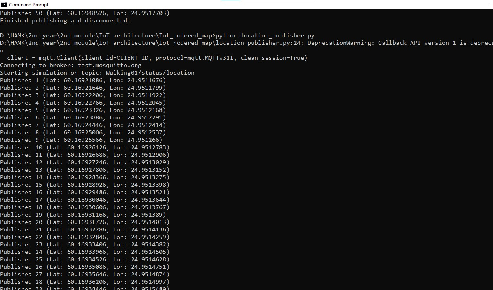
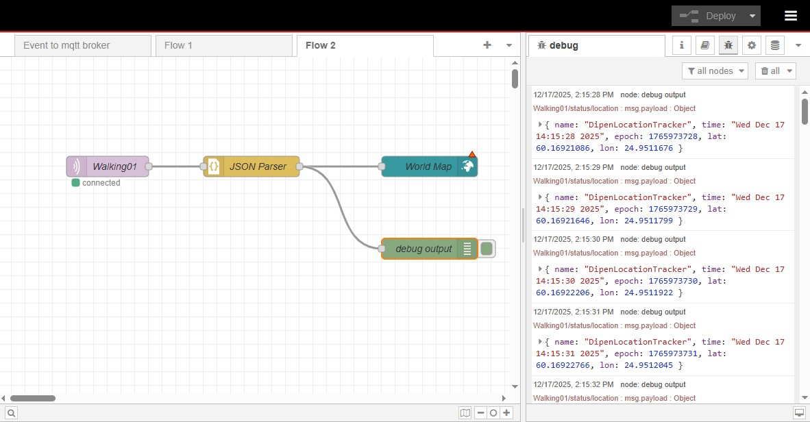
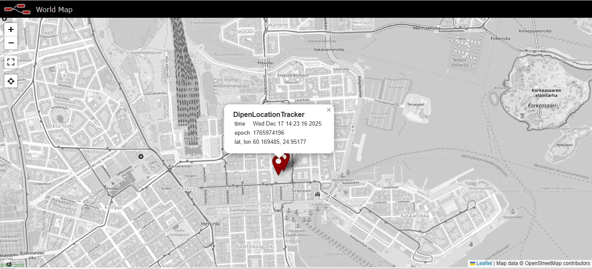
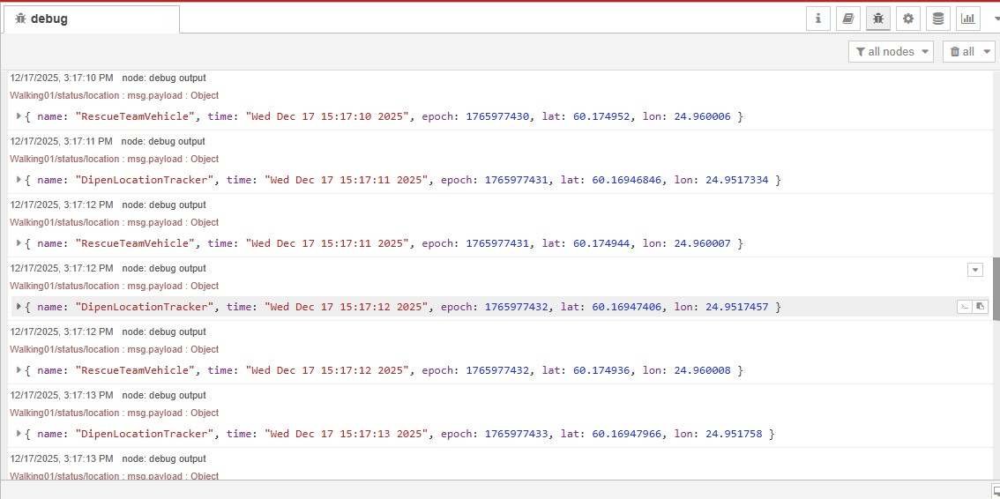
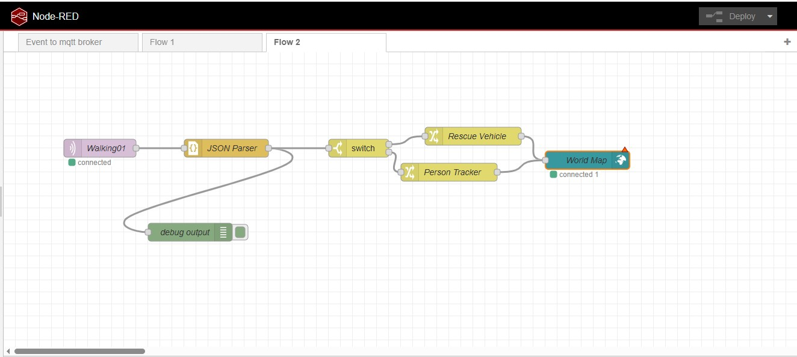
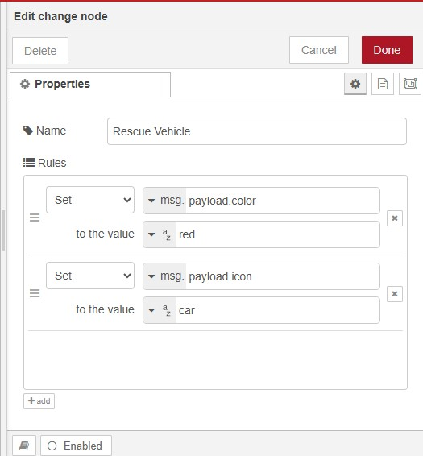
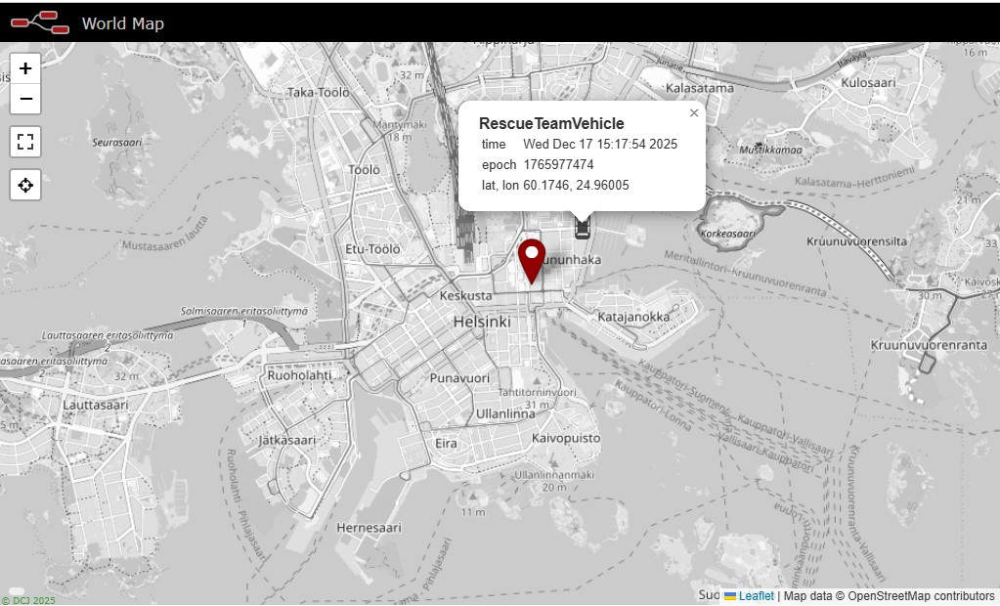

# Multi-Asset IoT Real-Time Location Tracking System

**Course:**  IoT Architecture

**Name:** Dipen Gaihre
## Overview

This project was developed as part of a university assignment to demonstrate the implementation of a real-time IoT-based location tracking system using Python, MQTT, and Node-RED.

The system simulates moving assets, publishes their GPS coordinates using MQTT, processes the data in Node-RED, and visualizes the movement on a real-time web-based map.

The project was implemented in two stages:
1. Single asset tracking
2. Multi-asset tracking with visual differentiation

---

## Real-World Application Example

A practical real-world example of this system is:

### Emergency Response Tracking System

- A rescue team vehicle is moving toward an emergency location.
- A field officer (on foot) is also moving within the same area.
- Both assets transmit their GPS coordinates to a central system.
- A control center monitors both locations in real time on a map.

This allows:
- Better coordination
- Real-time visibility
- Improved response efficiency
- Asset differentiation (vehicle vs personnel)

The university implementation simulates this scenario using two virtual devices:
- `DipenLocationTracker` (Person)
- `RescueTeamVehicle` (Vehicle)

---

## Technologies Used

- Python
- MQTT (Public Broker: test.mosquitto.org)
- Node-RED
- World Map Node
- JSON

---

# Phase 1 – Single Asset Tracking

## System Description

In the first phase:

- A Python script simulates a moving person.
- The script generates updated latitude and longitude every second.
- The data is formatted as JSON.
- The JSON payload is published to an MQTT topic.
- Node-RED subscribes to the topic.
- The World Map node visualizes the movement in real time.

---

## Python Publisher (Single Tracker)

File Location:


[person_tracker](./codes/location_publisher.py)


---

## Node-RED Flow (Single Tracker)

Description:
- MQTT Input Node
- JSON Parser
- World Map Node

### Screenshot Evidence

### 1. Python Publisher Output

```
images/01_basic_python_publisher_cmd_output_p3_report1.png
```



---

### 2. Node-RED Flow and Debug Output




---

### 3. World Map Visualization (Single Tracker)




-------

# **Phase 2 – Multi-Asset Tracking System**

## System Upgrade Description

In the second phase, the system was extended to track multiple assets simultaneously.

A second Python publisher was created to simulate another device operating in a different location.

Two independent trackers publish data to the same MQTT topic:

- DipenLocationTracker (Person)
- RescueTeamVehicle (Vehicle)

---

## Python Publisher (Second Tracker)

File Location:

[vehicle_tracker_code](./codes/location_publisher_2.py)


## Node-RED Enhancement (Multi-Asset Logic)

To differentiate assets visually:

- A **Switch Node** was added.
- Messages are routed based on device name.
- Change Nodes modify:
  - Marker color
  - Marker icon

### Logic Example

If:
- name == "RescueTeamVehicle" → Red color + Car icon
- name == "DipenLocationTracker" → Blue color

---

## Screenshot Evidence

### 4. Dual Python Publishers Running


---

### 5. Debug Output for Multiple Devices




---

### 6. Node-RED Flow with Switch Node



---

### 7. Change Node Configuration (Styling)




---

### 8. Final World Map – Dual Asset Visualization




---

##  Project Contents
* **Python Scripts:** [codes](./codes)
* **Full Report:** [reports](./report/)
* **Media Folder:** [/media/](./media)
* **Dependencies:** [requirements.txt](./requirements.txt)
---


# How to Run

1. Install dependencies:

```
pip install paho-mqtt
```

2. Run first tracker:

```
python codes/location_publisher.py
```

3. Run second tracker:

```
python codes/location_publisher_2.py
```

4. Start Node-RED
5. Deploy the flow
6. Open:

```
http://127.0.0.1:1880/worldmap
```

---

# Conclusion

This project demonstrates:

- MQTT-based publish/subscribe architecture
- Real-time GPS simulation using Python
- Data processing with Node-RED
- Multi-asset tracking using conditional routing
- Visual differentiation of assets on a live map

The system provides a simplified simulation of real-world asset tracking used in logistics, emergency response, and fleet management systems.

---

#  References
 HAMK- IoT Architecture course 

---
---
*Developed as part of the University IoT Architecture course.*