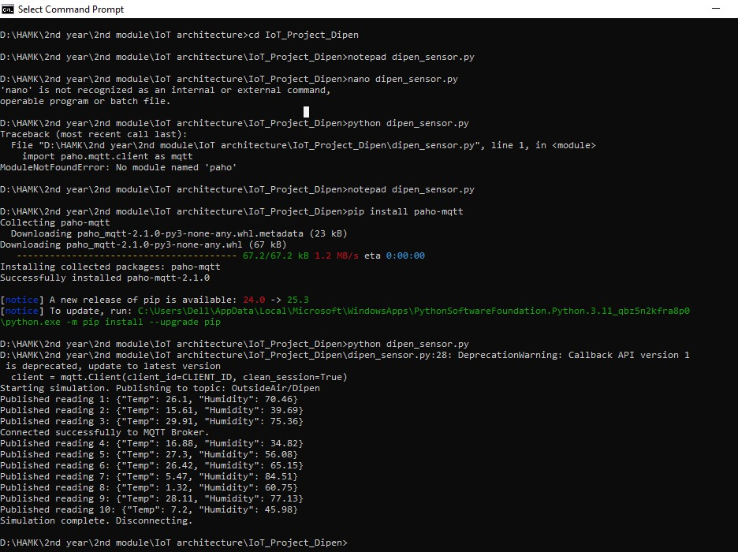
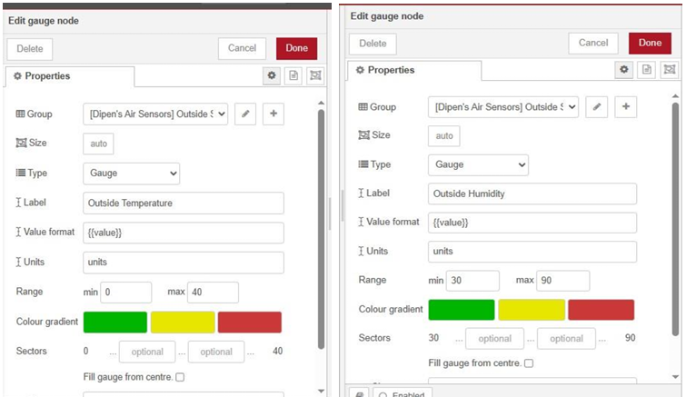
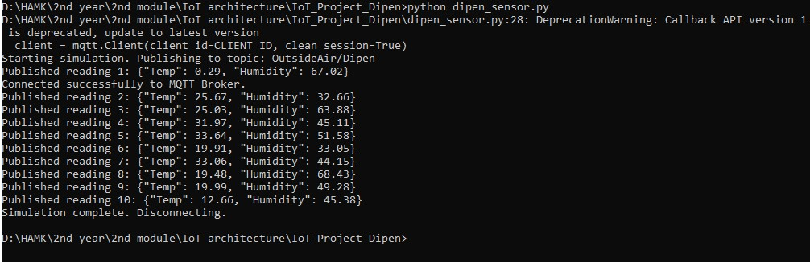
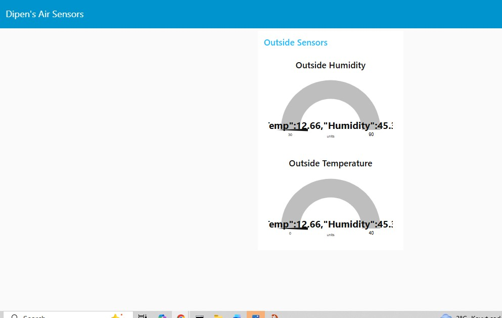

#  End-to-End Environmental Sensor Dashboard

This project demonstrates a complete IoT data pipeline: from simulating sensor hardware with **Python**, transmitting data via the **MQTT** protocol, to real-time visualization on a **Node-RED Dashboard**.

###  System Architecture
The project follows a three-tier architecture to ensure data integrity and real-time performance:

1.  **Data Generation (The Publisher):** A Python script (`dipen_sensor.py`) simulates a temperature and humidity sensor.
2.  **Data Transport:** Communication is handled by an MQTT Broker (`test.mosquitto.org`), using JSON strings to ensure the payload is lightweight and easy to parse.
3.  **Visualization (The Subscriber):** Node-RED subscribes to the topic, parses the JSON, and displays the values on custom-scaled gauges.

---

###  1. The Python Publisher
I developed a Python client using the `paho-mqtt` library. The script generates 10 unique readings within specific ranges (0-40°C for Temperature and 30-90% for Humidity) and publishes them as a JSON object.

* **Evidence:** The screenshot below shows the terminal successfully publishing data packets.

------
* **Code Link:** [dipen_sensor.py](./codes/dipen_sensor.py)
-----

---

###  2. Node-RED Logic & Scaling
The "highest-point task" of this project was to ensure the dashboard gauges were calibrated correctly to the sensor's physical limits. This ensures that the visual representation accurately reflects the simulated environment.

* **Temperature Scale:** 0°C to 40°C
* **Humidity Scale:** 30% to 90%

---

###  3. Final Dashboard Results
The final result is a professional web UI that updates in real-time as the Python script runs. The gauges successfully received and displayed the final values (e.g., Temp: 12.66, Humidity: 45) sent from the simulator.

    

---

###  Key Technical Skills Demonstrated
* **Python Programming:** Utilizing `json`, `random`, and `paho.mqtt` libraries.
* **Data Serialization:** Structuring data into JSON format for industrial compatibility.
* **MQTT Protocol:** Managing topics, Client IDs, and Broker connections.
* **UI/UX Design:** Creating intuitive dashboards with Node-RED.

---
*This project was completed as part of my University IoT Architecture course.*