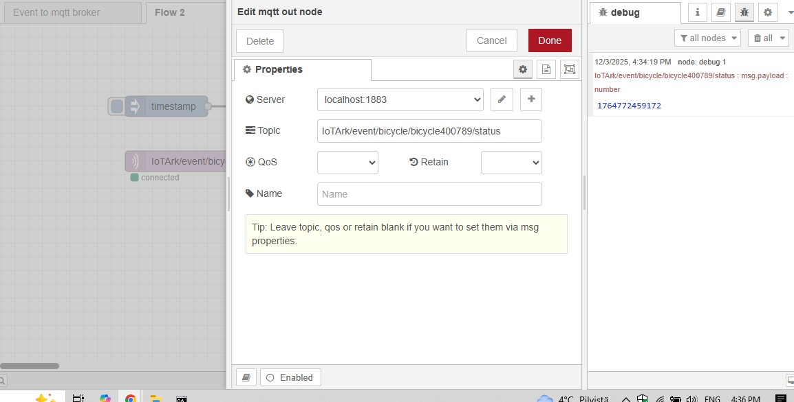
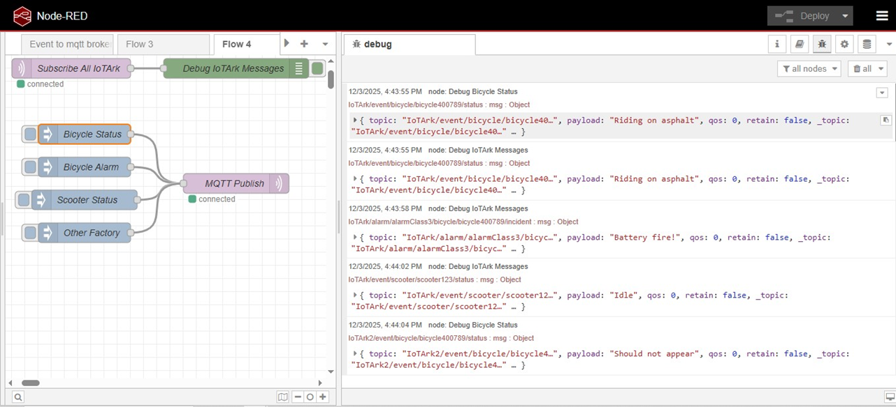

# Industrial MQTT Topic Architecture Validation

This project demonstrates the implementation of a hierarchical messaging structure for a simulated industrial factory network (**IoTArk**). I validated three specific levels of data subscription to ensure efficient message routing.

###  Backend Configuration
To establish communication, I configured the MQTT nodes to connect to the local broker, ensuring the topics matched the industrial standards of the factory.

###  Wildcard Implementation & Logic
I used two types of MQTT wildcards to manage high-volume data:

1.  **Single-level (+):** Used to monitor all devices in the "Bicycle" category (e.g., `IoTArk/event/bicycle/+/status`).
2.  **Multi-level (#):** Implemented a "Master Listener" to capture all system-wide alarms across the entire factory.

###  Live Data Results
The screenshot below confirms the system is working. You can see the debug window successfully capturing specific events like **"Battery fire"** and **"Riding on asphalt"** from multiple different topic levels.

---
*Developed as part of the University IoT Architecture module.*